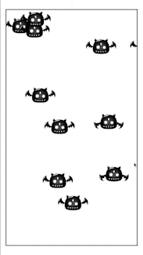

# JS Games

## Sprite Animation [(Code and Files)](https://github.com/isumtk/javascript-games/tree/sprite-animations)

Sprite Animations are a popular choice for bringing 2D assets to life. Typically, these animations are created using a Sprite Sheet—a grid of individual images representing different stages of the animation.

To create the animation, the individual sprites are combined into an Animation Clip, which plays them in sequence to produce the desired effect, akin to a flipbook.

For this particular animation, I opted to use this approach, resulting in a smooth and engaging final product.

## Parallax Background [(Code and Files)](https://github.com/isumtk/javascript-games/tree/parallax-backgrounds)

Parallax backgrounds are a popular technique used in game development to create the illusion of depth in a 2D game world. Essentially, the technique involves creating multiple layers of background art that move at different speeds to simulate the effect of objects appearing to move at different distances from the player's perspective.

For example, a foreground layer may move quickly, while a mid-ground layer moves slower, and a background layer moves even slower. This creates the impression of depth and movement in the game world, even though it is still a 2D environment.

## Non-Playable Characters (NPCs) [(Code and Files)](https://github.com/isumtk/javascript-games/tree/npc-movement-pattern-1)

NPC movements in game development refer to the behavior and actions of non-playable characters (NPCs) within a game world. NPC movements can be critical to the overall gameplay experience, as they can affect the player's interactions with the game world and other NPCs.

There are several ways to implement NPC movements in game development. One common approach is to use scripted sequences or animations, which are pre-programmed actions that the NPCs perform at specific times or in response to certain events. For example, an NPC might move from one location to another in response to a trigger event, such as the player approaching a certain area.

