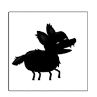

# JS Games

## Sprite Animation

Sprite Animations are a popular choice for bringing 2D assets to life. Typically, these animations are created using a Sprite Sheet—a grid of individual images representing different stages of the animation.

To create the animation, the individual sprites are combined into an Animation Clip, which plays them in sequence to produce the desired effect, akin to a flipbook.

For this particular animation, I opted to use this approach, resulting in a smooth and engaging final product.

